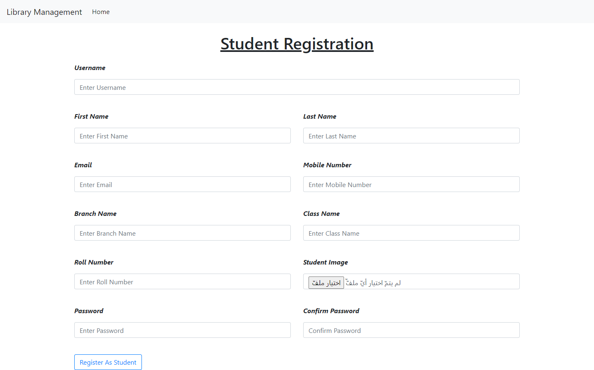

# Library Management
 


#
# Admin Paqge
<code>
Login Administrator
</code>


<code>
page Administrator
</code>


<code>
Show all Books
</code>


<code>
Add Books
</code>

<code>
Show all Isued Books
</code>

<code>
Add Isued Books
</code>


#
# Student Page

<code>
Login Page
</code>


<code>
Register Page
</code>


<code>
Main  Page Student
</code>


<code>
Edit  Page Student
</code>


<code>
Change Password
</code>


<code>
View Books
</code>


#Installation
```
pip install django
virtualenv env
```

# For Mac/ Linux
```
source env/bin/activate
```

# For Window
```
env\scripts\activate
pip install -r requirements.txt
python manage.py makemigrations
python manage.py migrate
python manage.py runserver
```

# For Admin Login
```
python manage.py createsuperuser
Username : admin
Password : 123
```